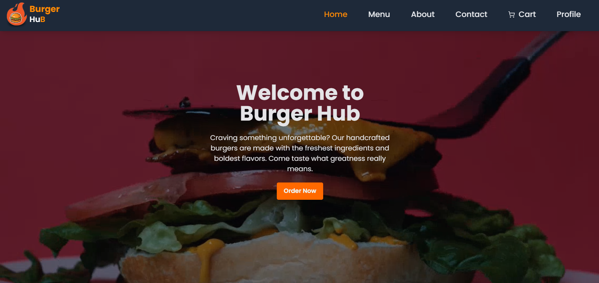
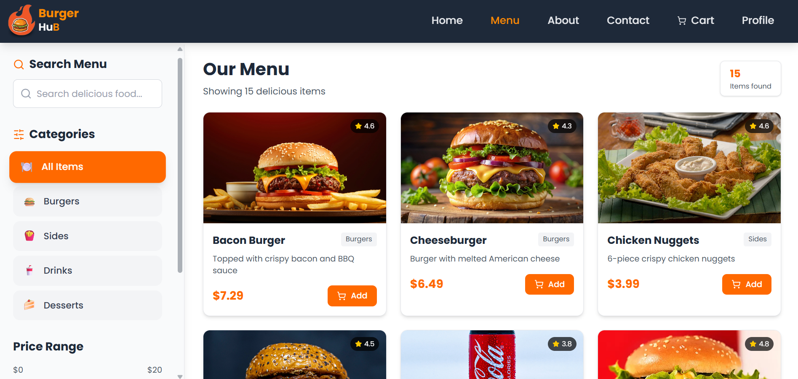
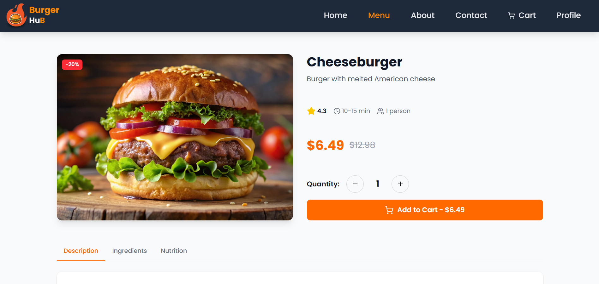
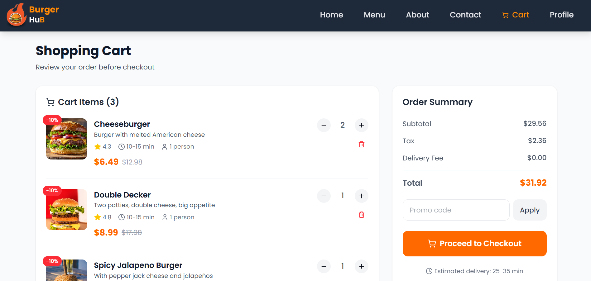

# 🍔 Burger Hub – Frontend

**Burger Hub** is a modern, full-stack burger ordering application where users can browse menus, view detailed items, filter and sort burgers and more, and place orders. It features full authentication, profile management, cart operations, and a seamless user interface with skeleton loaders.

This is the **frontend** (React + Vite) repository, which connects to a **Laravel backend** via **Sanctum authentication** and a REST API.

---

## 🌟 Features

- 👤 **User Authentication**: Register, Login, and Logout (via Laravel Sanctum)
- 🔐 **Protected Routes** using Bearer Tokens
- 🍔 **Menu Page**: Browse all burgers with search, category filters, and sort by price or rating
- 🔍 **Search & Filter**: Search burgers, filter by category, and sort by price or popularity
- 📄 **Detail Page** for each menu item with complete description and image
- 🛒 **Cart Management**: Add to cart, update quantity, remove items
- 🧾 **Order Placement**: Place an order directly from the cart
- 👤 **Profile Page**: View and update user profile information
- 💅 **DaisyUI Skeleton Loaders**: Improve user experience while data loads
- 📱 Fully **Responsive UI** using Tailwind CSS and DaisyUI
- 🚀 **Toast Notifications** with React Toastify
- ✅ **Form Validation** using `react-hook-form` and `yup`
- 🔗 **API Integration** with Axios and Redux Toolkit for state management

---

## 🛠 Tech Stack

### 🧩 Frontend

- [Vite](https://vitejs.dev/)
- [React](https://reactjs.org/)
- [Tailwind CSS](https://tailwindcss.com/)
- [DaisyUI](https://daisyui.com/)
- [Redux Toolkit](https://redux-toolkit.js.org/)
- [React Hook Form](https://react-hook-form.com/)
- [Yup](https://github.com/jquense/yup)
- [Lucide React Icons](https://lucide.dev/)
- [Axios](https://axios-http.com/)
- [React Toastify](https://fkhadra.github.io/react-toastify/)

### ⚙️ Backend

- [Laravel](https://laravel.com/)
- [Laravel Sanctum](https://laravel.com/docs/sanctum)
- [Git Repo](https://github.com/Sarathmithran/Burger-Hub-api)
- RESTful API
- MySQL Database

---

## 📸 Screenshots

---

### 🧑‍💻 Happy coding!